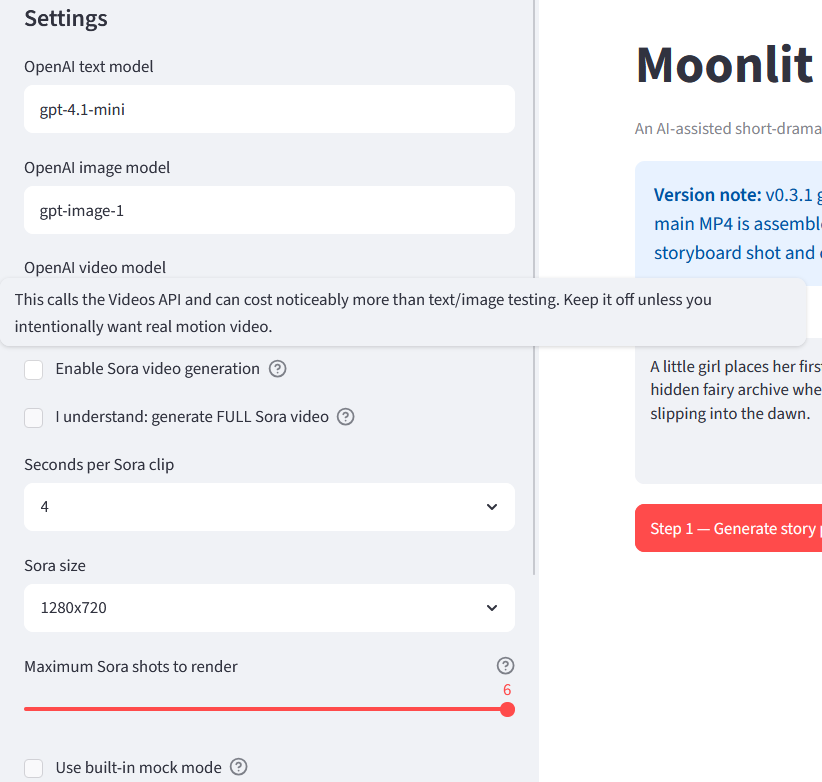
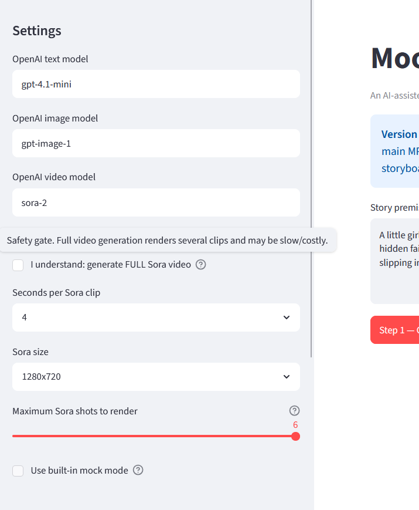
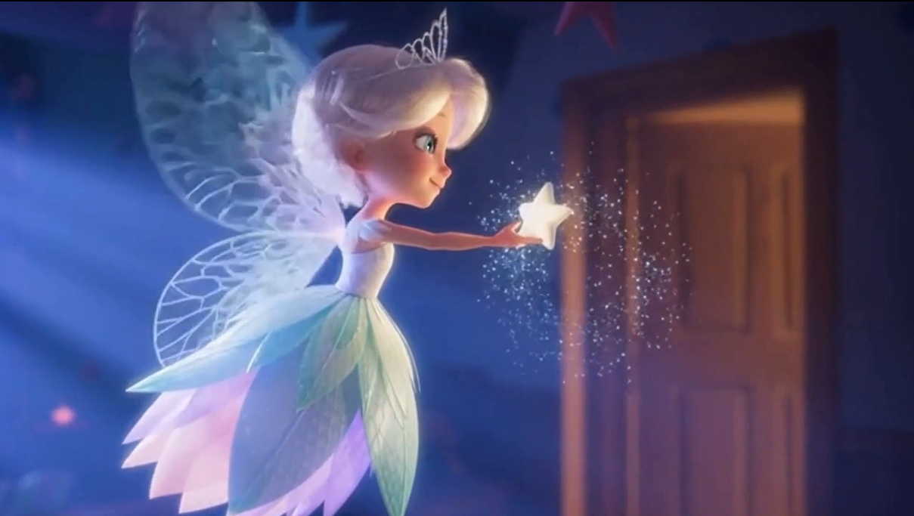
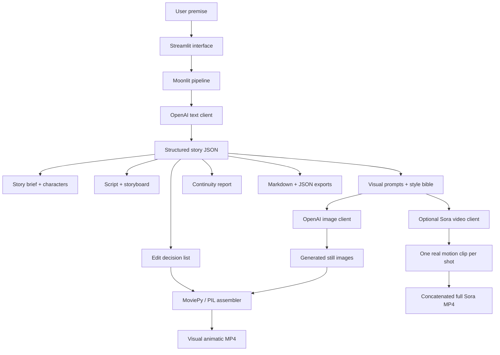

# Moonlit Showrunner


**An AI-assisted short-drama pipeline from premise to visual animatic and optional Sora-generated video output.**

Moonlit Showrunner turns a magical or emotional story premise into a structured short-drama production package and a simple visual animatic workflow.

It currently generates:

- story brief
- logline
- character cards
- 6-scene script
- storyboard
- visual style bible
- scene image prompts
- continuity report
- edit decision list
- generated still images for each shot *(new in v0.3)*
- MP4 assembled from still images or fallback scene cards

> **Current status:** v0.5 is a working prototype. It generates a structured narrative production package, stylized scene images, a visual animatic MP4, and—when explicitly enabled—one Sora video clip per storyboard shot, concatenated into a full video output.
>
> The project remains a prototype: character consistency across video clips is not yet fully enforced, and the Sora workflow is intentionally gated to avoid accidental paid video-generation calls.

---

## Demo concept

Sample premise:

> A little girl places her first lost tooth under her pillow, afraid that growing up means losing pieces of herself. At midnight, the tooth opens a tiny moonlit doorway into a hidden fairy archive where children’s memories become stars. By morning, she finds a coin and a faint sparkle on the windowsill, while the viewer sees the tooth fairy slipping into the dawn.

---

## Screenshots

### Main interface and story brief

The v0.5 interface includes the full pipeline: story generation, scene-image generation, animatic assembly, and optional full Sora video generation.


### Script and storyboard planning


### Visual prompts and continuity pass


### v0.3.1 visual animatic output

The v0.3.1 prototype added generated stylized scene images and assembled them into a visual animatic MP4.


### v0.5 Sora safety controls

The v0.5 Sora workflow includes explicit safety controls to prevent accidental paid full-video generation calls.






---

## Generated video output

The v0.5 prototype can generate a full Sora-assisted video output from the structured story pipeline.

[](https://youtu.be/4bzG4uo8bso)

[Watch the generated video output on YouTube](https://youtu.be/4bzG4uo8bso)

This video is the generated short-drama output from Moonlit Showrunner v0.5. It was produced from the project’s pipeline: story package, storyboard, visual prompts, generated scene assets, Sora video clips, and final MP4 assembly.

It is not a walkthrough of the app interface; a separate project demo video may be added later.

---

## Pipeline evolution

Moonlit Showrunner has evolved in stages:

### v0.3 / v0.3.1 — Visual animatic prototype

The v0.3 line demonstrated the first complete creative pipeline:

```text
Premise
→ structured story package
→ script
→ storyboard
→ scene image prompts
→ generated still images
→ continuity report
→ edit decision list
→ visual animatic MP4 assembly
```

This stage generated stylized still images and assembled them into a simple visual animatic using MoviePy. It did not generate true AI motion video clips.

### v0.5 — Full Sora-assisted video prototype

Version 0.5 extends the pipeline with optional real video generation:

```text
Premise
→ structured story package
→ script
→ storyboard
→ scene image prompts
→ generated still images
→ visual animatic MP4
→ optional Sora clip per storyboard shot
→ concatenated full video output
```

The visual animatic remains the fast, reliable default workflow. The Sora step is optional and explicitly gated because video generation is slower and can incur higher API costs.


---

## Architecture



---

## Quick start on Windows PowerShell

```powershell
python -m venv .venv
.venv\Scripts\python.exe -m pip install --upgrade pip
.venv\Scripts\python.exe -m pip install -r requirements.txt
```

Create `.streamlit\secrets.toml` from the example file:

```powershell
Copy-Item .streamlit\secrets.toml.example .streamlit\secrets.toml
```

Then add your API key:

```toml
OPENAI_API_KEY = "your-key-here"
OPENAI_MODEL = "gpt-4.1-mini"
OPENAI_IMAGE_MODEL = "gpt-image-1"
OPENAI_VIDEO_MODEL = "sora-2"
```

Run:

```powershell
.venv\Scripts\python.exe -m streamlit run app\streamlit_app.py
```

If no API key is provided, or if you want to test without spending credits, the app can run in **mock mode** using a built-in sample story package and placeholder scene images.

---

## How to use the app

1. Enter or keep the sample premise.
2. Click **Step 1 — Generate story package**.
3. Review the generated tabs: story brief, script, storyboard, visual prompts, continuity, and edit plan.
4. Click **Step 2 — Generate scene images**.
5. Click **Step 3 — Assemble MP4 from current run**.
6. Optional: enable both Sora safety toggles in the sidebar and click **Step 4 — Generate full real Sora video**.
7. Download the JSON and Markdown exports from the **Exports** tab.

Each run is saved into a timestamped folder under:

```text
outputs/runs/
```

---

## Command-line generation

Generate a sample package, placeholder images, and MP4 without Streamlit:

```powershell
.venv\Scripts\python.exe scripts\generate_sample.py
```

The app now uses run-specific folders such as:

```text
outputs/
└── runs/
    └── 2026-06-09_153200/
        ├── story_package.json
        ├── story_package.md
        ├── images/
        ├── frames/
        ├── moonlit_showrunner_animatic.mp4
        └── sora_video/          # optional full real motion video output
```

Curated earlier outputs can still live under:

```text
outputs/v0.1/
```

---

## Project structure

```text
moonlit-showrunner/
├── app/
│   ├── streamlit_app.py
│   ├── pipeline.py
│   ├── openai_client.py
│   ├── image_client.py
│   ├── schemas.py
│   ├── sample_data.py
│   ├── agents/
│   └── video/
├── assets/
│   └── screenshots/
│       ├── image-1.png
│       ├── image-2.png
│       └── ...
├── docs/
├── outputs/
│   ├── runs/
│   └── v0.1/
├── scripts/
├── requirements.txt
├── README.md
└── LICENSE
```

---

## Current limitations

* The Sora video workflow generates one clip per storyboard shot, then concatenates the clips into a full MP4; it is not yet a fully continuous single-shot film generation pipeline.
* Character appearance consistency across Sora-generated clips is guided through prompts and the style bible, but not yet fully enforced like a dedicated character-locking or animation production pipeline.
* The visual animatic MP4 remains useful as a fast preview, but it is assembled from still images, captions, overlays, and edit-plan timing rather than true motion video.
* Audio is still represented as edit-plan guidance rather than a fully generated soundtrack, voiceover, or sound design layer.
* The image and video generation steps do not yet include built-in review controls for regenerating only one specific shot from inside the app.
* The Sora workflow is intentionally gated with safety toggles because video generation can be slower and more expensive than text or image generation.

---

## Planned improvements

* Add review controls for regenerating a single scene image or Sora video shot without rerunning the full pipeline.
* Add stronger character-consistency controls through reusable character reference prompts, shot-level continuity checks, and optional visual reference assets.
* Add selective prompt editing before image or video generation.
* Improve the visual animatic with richer pan/zoom effects, transitions, caption styling, and pacing controls.
* Add optional voiceover, soundtrack, or sound-design generation.
* Add clearer run comparison tools for evaluating different versions of the same story.
* Prepare a polished blog article / portfolio write-up explaining the architecture, design choices, limitations, and next steps.


---

## Why this exists

Short-form narrative production usually requires several creative roles: writer, storyboard artist, visual director, continuity checker, and editor. Moonlit Showrunner explores how those roles can be represented as a transparent AI pipeline, with outputs that remain reviewable and editable by a human creator.

The project is intentionally honest about its current scope: it is a **visual animatic prototype**, not yet a finished AI film generator.

---

## License

This project is released under the MIT License.
