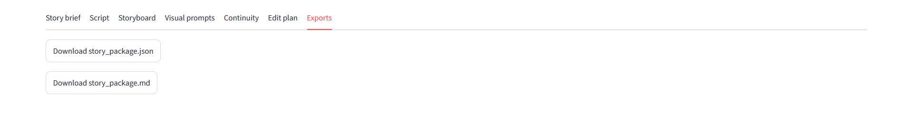
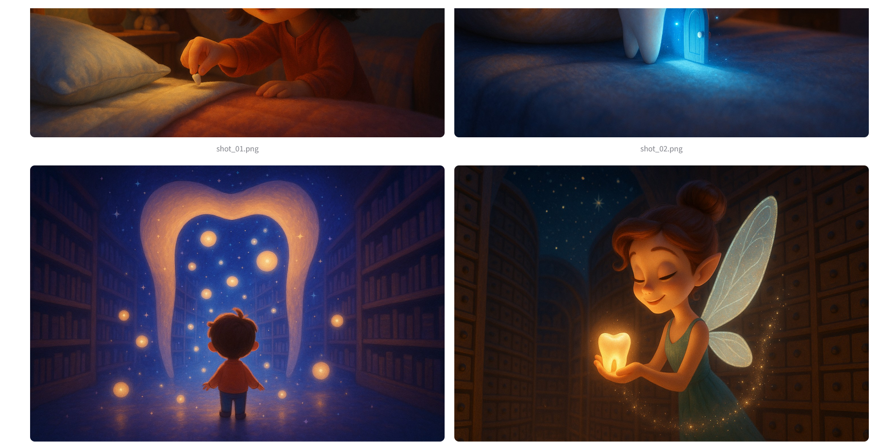
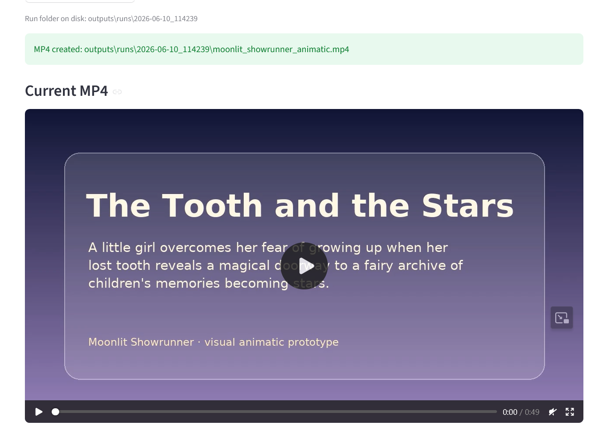
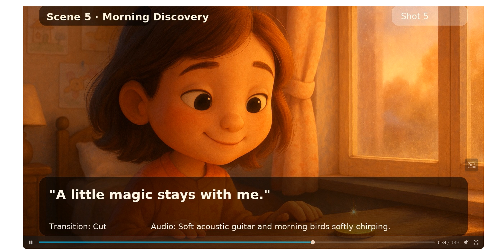
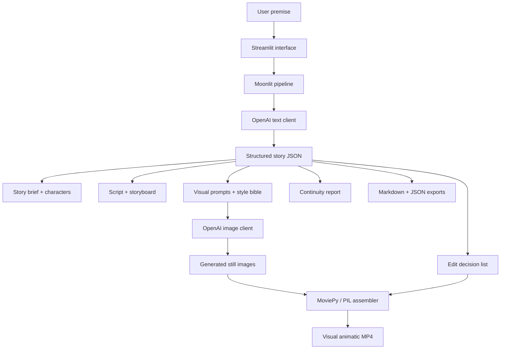

# Moonlit Showrunner


**Moonlit Showrunner is an AI-assisted short-drama pipeline that turns a magical story premise into a structured production package, generated scene images, and a visual animatic MP4.**

The project explores how an AI system can coordinate several creative roles — showrunner, scriptwriter, storyboard planner, visual director, continuity checker, and editor — while keeping the outputs inspectable and editable.

It currently generates:

* story brief
* logline
* character cards
* 6-scene script
* storyboard
* visual style bible
* scene image prompts
* continuity report
* edit decision list
* stylized 3D animated still images for each shot, displayed in the app and reused in the MP4 animatic
* MP4-ready frames with overlays, captions, and timing
* visual animatic MP4 assembled from still images or fallback scene cards

> **Current status — v0.3.1:**
> Moonlit Showrunner now generates a structured story package, stylized scene images, MP4-ready frames, and a visual animatic video.
> It does **not** yet generate full motion AI video clips. The final MP4 is assembled from still images, captions, overlays, and edit-plan timing.

---

## Demo concept

Sample premise:

> A little girl places her first lost tooth under her pillow, afraid that growing up means losing pieces of herself. At midnight, the tooth opens a tiny moonlit doorway into a hidden fairy archive where children’s memories become stars. By morning, she finds a coin and a faint sparkle on the windowsill, while the viewer sees the tooth fairy slipping into the dawn.

---

## Screenshots

## Screenshots

### Main interface and story brief


### Script and storyboard planning


### Visual prompts and continuity pass


### Edit plan and exports




### v0.3.1 visual animatic output

The v0.3.1 prototype adds generated stylized scene images and assembles them into a visual animatic MP4.








---

## What v0.3.1 does

Version 0.3.1 demonstrates this pipeline:

```text
Premise
→ structured story package
→ script
→ storyboard
→ scene image prompts
→ stylized generated still images
→ continuity report
→ edit decision list
→ MP4-ready frames
→ visual animatic MP4 assembly
```

The generated MP4 is currently a **prototype animatic**. The image prompts are biased toward a stylized 3D family-animation look rather than photorealistic live-action actors. It uses still images plus overlays, captions, and edit-plan timing — not full AI-generated motion video.

---

## What changed in v0.3.1

* Added stronger visual direction toward a stylized 3D family-animation look.
* Reduced photorealistic live-action output by steering prompts away from realistic actors.
* Improved the Streamlit flow so Step 2 and Step 3 buttons no longer become mysteriously disabled.
* Updated the Generated Images tab to show both raw generated images and MP4-ready assembled frames.
* Improved the project framing as a visual animatic prototype rather than a full AI video generator.
- Added screenshots documenting the generated scene images and the assembled visual animatic MP4.

---

## Architecture



---

## Quick start on Windows PowerShell

```powershell
python -m venv .venv
.venv\Scripts\python.exe -m pip install --upgrade pip
.venv\Scripts\python.exe -m pip install -r requirements.txt
```

Create `.streamlit\secrets.toml` from the example file:

```powershell
Copy-Item .streamlit\secrets.toml.example .streamlit\secrets.toml
```

Then add your API key:

```toml
OPENAI_API_KEY = "your-key-here"
OPENAI_MODEL = "gpt-4.1-mini"
OPENAI_IMAGE_MODEL = "gpt-image-1"
```

Run:

```powershell
.venv\Scripts\python.exe -m streamlit run app\streamlit_app.py
```

If no API key is provided, or if you want to test without spending credits, the app can run in **mock mode** using a built-in sample story package and placeholder scene images.

---

## How to use the app

1. Enter or keep the sample premise.
2. Click **Step 1 — Generate story package**.
3. Review the generated tabs: story brief, script, storyboard, visual prompts, continuity, and edit plan.
4. Click **Step 2 — Generate scene images**.
5. Click **Step 3 — Assemble MP4 from current run**.
6. Download the JSON and Markdown exports from the **Exports** tab.

Each run is saved into a timestamped folder under:

```text
outputs/runs/
```

---

## Command-line generation

Generate a sample package, placeholder images, and MP4 without Streamlit:

```powershell
.venv\Scripts\python.exe scripts\generate_sample.py
```

The app uses run-specific folders such as:

```text
outputs/
└── runs/
    └── 2026-06-09_153200/
        ├── story_package.json
        ├── story_package.md
        ├── images/
        ├── frames/
        └── moonlit_showrunner_animatic.mp4
```

Curated earlier outputs can still live under:

```text
outputs/v0.1/
```

---

## Project structure

```text
moonlit-showrunner/
├── app/
│   ├── streamlit_app.py
│   ├── pipeline.py
│   ├── openai_client.py
│   ├── image_client.py
│   ├── schemas.py
│   ├── sample_data.py
│   ├── agents/
│   └── video/
├── assets/
│   └── screenshots/
│       ├── image-1.png
│       ├── image-2.png
│       └── ...
├── docs/
├── outputs/
│   ├── runs/
│   └── v0.1/
├── scripts/
├── requirements.txt
├── README.md
└── LICENSE
```

---

## Current limitations

* v0.3.1 does **not** generate full AI motion video clips.
* The final MP4 is assembled from still images or fallback scene cards.
* Character consistency is guided through prompts and the style bible, but not fully enforced like a dedicated animation pipeline would.
* Audio is still represented as edit-plan guidance rather than a fully generated soundtrack.
* The current image generation step does not yet include iterative review or shot regeneration controls.
* The visual result depends on the image model’s interpretation of the generated prompts.

---

## Planned improvements

* stronger review controls for regenerating only one scene image
* selective prompt editing before image generation
* optional caption styling controls
* improved pan/zoom and transition effects in the animatic
* optional voiceover or soundtrack layer
* optional export of a production bible
* future integration with true AI video generation
* polished blog article / portfolio write-up

---

## Why this exists

Short-form narrative production usually requires several creative roles: writer, storyboard artist, visual director, continuity checker, and editor. Moonlit Showrunner explores how those roles can be represented as a transparent AI pipeline, with outputs that remain reviewable and editable by a human creator.

The project is intentionally honest about its current scope: it is a **visual animatic prototype**, not yet a finished AI film generator.

---

## License

This project is released under the MIT License.
