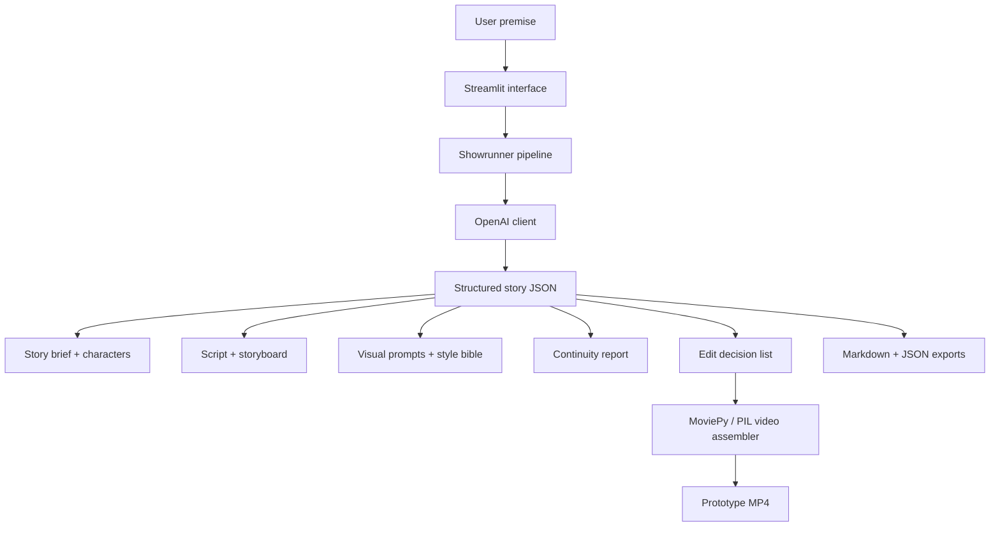

# Moonlit Showrunner


**An AI-assisted short-drama pipeline from premise to MP4.**

Moonlit Showrunner turns a simple magical or emotional premise into a structured short-drama production package:

- story brief
- logline
- character cards
- 6-scene script
- storyboard
- visual style bible
- image/video prompts
- continuity report
- edit decision list
- simple MP4 assembled from generated title cards, scene cards, captions, and transitions

The project is a polished local/OpenAI prototype exploring how structured LLM workflows can support short-form cinematic storytelling.

> **Current status:** v0.1 is a working prototype. It generates the narrative production package with the OpenAI API and assembles a simple MP4 from generated cards/frames. It does **not** yet generate real AI video footage. Future versions may connect image or video generation models for fully visual scene assets.

---

## Demo concept

Sample premise:

> A little girl places her first lost tooth under her pillow, afraid that growing up means losing pieces of herself. At midnight, the tooth opens a tiny moonlit doorway into a hidden fairy archive where children’s memories become stars. By morning, she finds a coin and a faint sparkle on the windowsill, while the viewer sees the tooth fairy slipping into the dawn.

---

## Screenshots

### Story package generation


### Story brief and character cards


### Script and storyboard planning


### Visual prompts, continuity, and edit plan


### Exports


---

## What v0.1 does

Version 0.1 demonstrates the core pipeline:

```text
Premise
→ structured story package
→ script
→ storyboard
→ visual prompt plan
→ continuity report
→ edit decision list
→ MP4 card assembly
```

The generated MP4 is currently a **prototype assembly**: it uses generated cards/frames and captions rather than real AI-generated video clips. This keeps the first version reproducible, lightweight, and easy to run locally.

---

## Architecture



---

## Quick start on Windows PowerShell

```powershell
python -m venv .venv
.venv\Scripts\python.exe -m pip install --upgrade pip
.venv\Scripts\python.exe -m pip install -r requirements.txt
```

Create `.streamlit\secrets.toml` from the example file:

```powershell
Copy-Item .streamlit\secrets.toml.example .streamlit\secrets.toml
```

Then add your API key:

```toml
OPENAI_API_KEY = "your-key-here"
OPENAI_MODEL = "gpt-4.1-mini"
```

Run:

```powershell
.venv\Scripts\python.exe -m streamlit run app\streamlit_app.py
```

If no API key is provided, the app can still run in **mock mode** using a built-in sample story package.

---

## How to use the app

1. Enter or keep the sample story premise.
2. Click **Generate story package**.
3. Review the generated tabs: story brief, script, storyboard, visual prompts, continuity, and edit plan.
4. Click **Assemble MP4** to create a simple prototype video from generated cards and captions.
5. Download the JSON and Markdown exports from the **Exports** tab.

---

## Command-line generation

Generate a sample package and MP4 without Streamlit:

```powershell
.venv\Scripts\python.exe scripts\generate_sample.py
```

Outputs are written to:

```text
outputs/
├── story_package.json
├── story_package.md
└── moonlit_showrunner_demo.mp4
```

For public examples, this repository can also include curated outputs under:

```text
outputs/v0.1/
```

---

## Project structure

```text
moonlit-showrunner/
├── app/
│   ├── streamlit_app.py
│   ├── pipeline.py
│   ├── openai_client.py
│   ├── schemas.py
│   ├── sample_data.py
│   ├── agents/
│   └── video/
├── assets/
│   └── screenshots/
│       ├── image-1.png
│       ├── image-2.png
│       └── ...
├── docs/
├── outputs/
│   └── v0.1/              # curated prototype outputs for GitHub
├── scripts/
├── requirements.txt
├── README.md
└── LICENSE
```

---

## Current limitations

- v0.1 does not generate real AI video footage.
- The MP4 is assembled from generated cards/frames and captions.
- Character consistency is represented in the visual style bible, not enforced through an image/video model yet.
- The UI is an early prototype and will be refined in future versions.
- Audio is currently represented as edit-plan guidance rather than a fully generated soundtrack.

---

## Planned improvements

- clearer two-step UI: **Step 1 — Generate story package**, **Step 2 — Assemble MP4**
- timestamped output folders for each run
- generated illustrated frames for each storyboard shot
- optional image-generation integration
- optional video-generation integration
- improved MP4 styling, motion, transitions, and typography
- demo article explaining the design of an AI showrunner pipeline

---

## Why this exists

Short-form narrative production usually requires several creative roles: writer, storyboard artist, visual director, continuity checker, and editor. Moonlit Showrunner explores how those roles can be represented as a structured AI pipeline, with outputs that remain reviewable and editable by a human creator.

The project is intentionally small and transparent: it shows the production logic before trying to hide everything behind a final generated video.

---

## License

This project is released under the MIT License.
