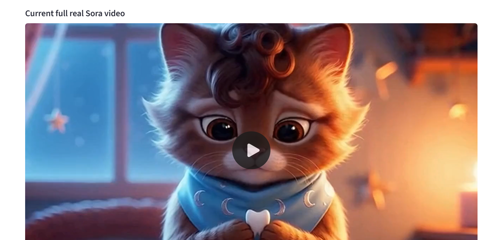
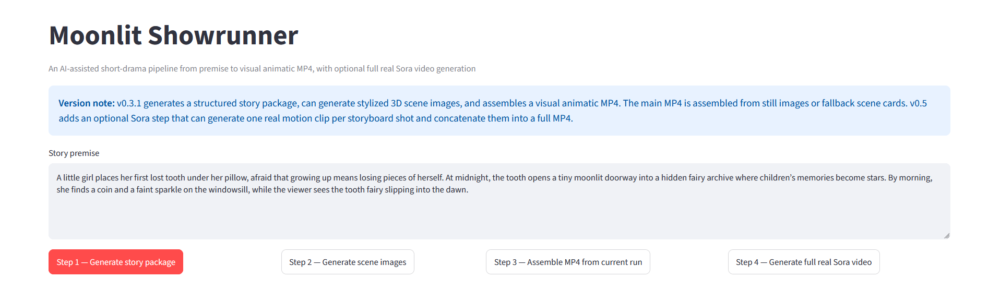
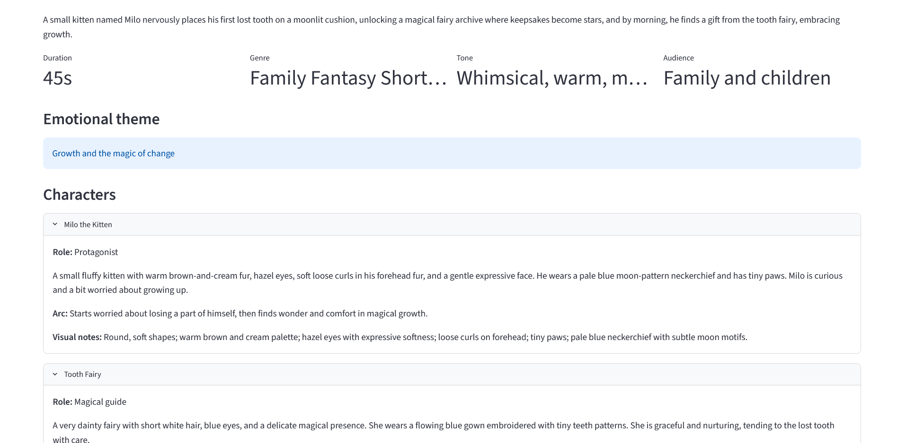
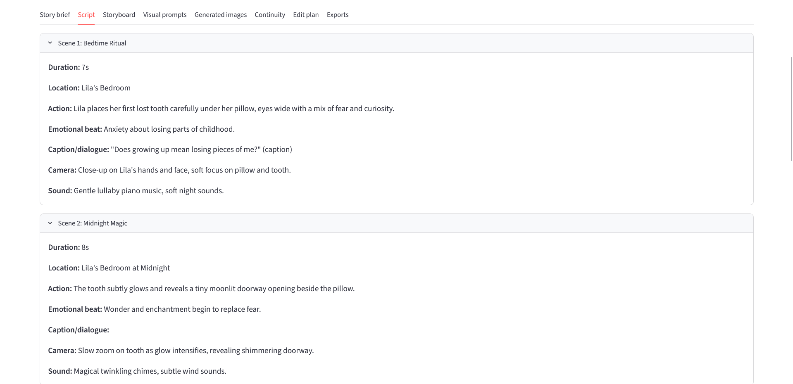
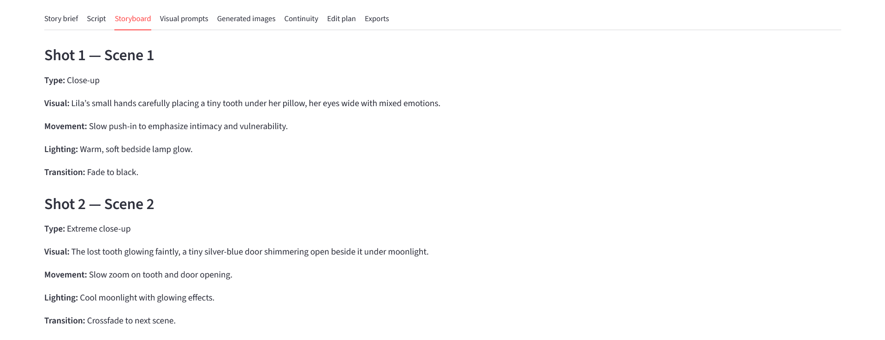
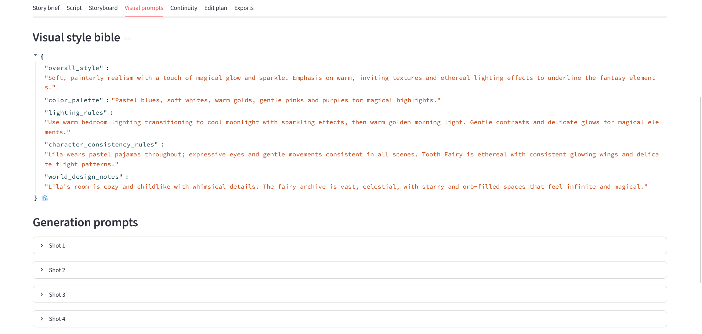
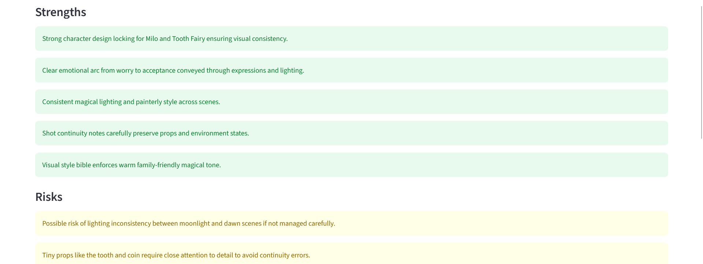
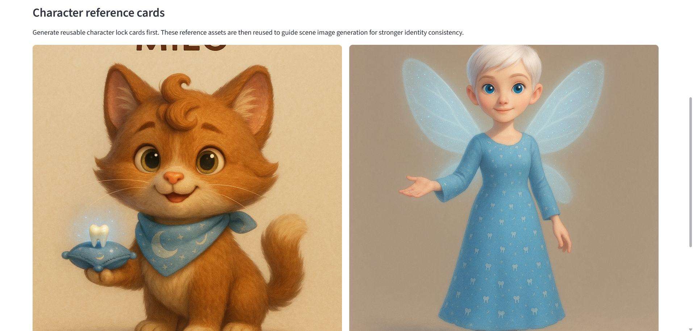
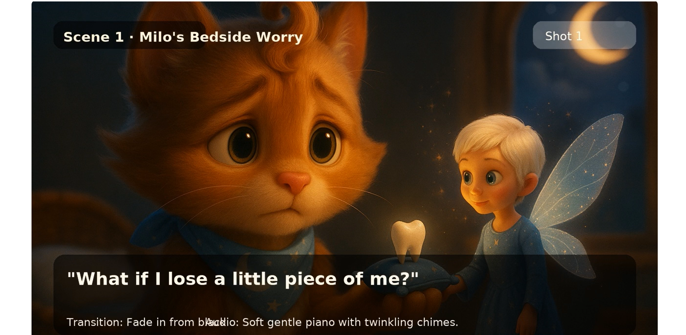
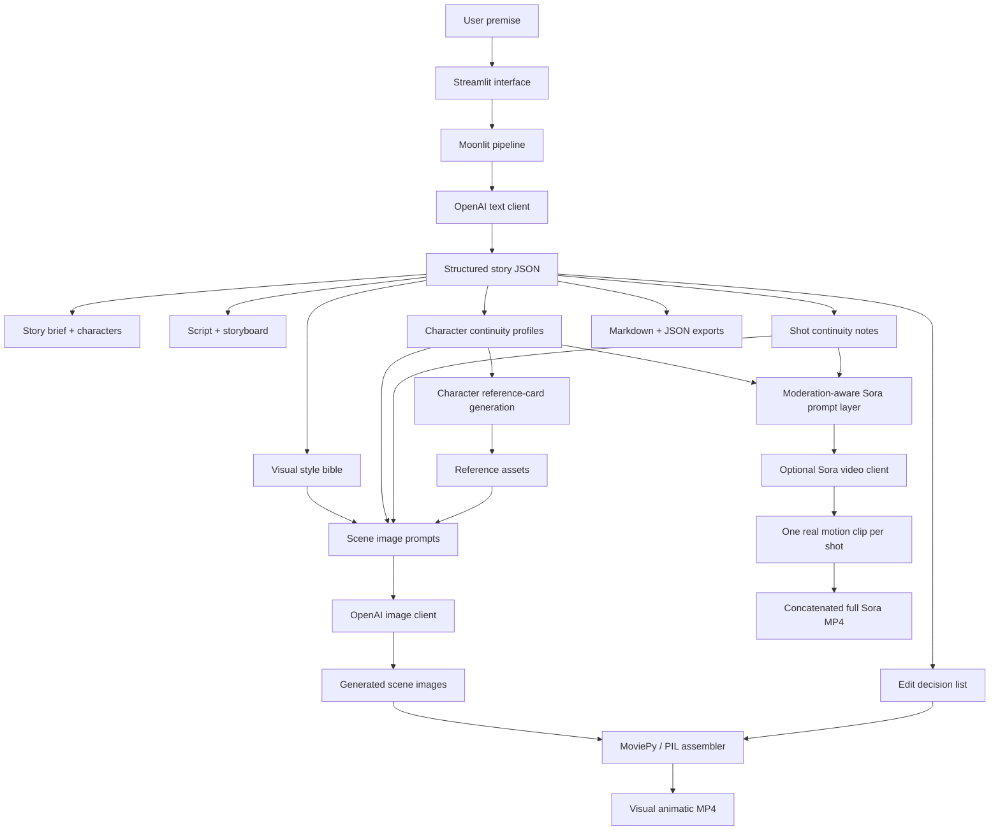

# Moonlit Showrunner


[](https://doi.org/10.5281/zenodo.20633401)

**An AI-assisted short-drama pipeline from premise to character-locked visual animatic and optional Sora-generated video output.**

Moonlit Showrunner turns a magical story premise into a structured short-drama production package, reusable character reference cards, continuity-aware scene prompts, generated images, a visual animatic MP4, and an optional full Sora-assisted video output.

The current version pivots the original tooth-fairy premise into a safer, more whimsical story about **Milo, a kitten who loses his first tooth**.

It currently generates:

- story brief and logline
- character cards
- 6-scene script
- storyboard
- visual style bible
- character continuity profiles
- global continuity lock
- shot-by-shot continuity memory
- reusable character reference cards
- generated still images for each shot
- MP4 assembled from generated images or fallback scene cards
- optional Sora clips per storyboard shot
- optional concatenated full Sora video output

> **Current status:** v0.7.3 is a working kitten-centered, character-locking prototype. It generates a structured narrative production package, character reference cards, stylized scene images, a visual animatic MP4, and—when explicitly enabled—one Sora video clip per storyboard shot, concatenated into a full video output.
>
> The project remains a prototype: character consistency is improved through reference cards, continuity prompts, and shot-level memory, but it is not yet equivalent to a dedicated production animation pipeline. The Sora workflow is intentionally budget-gated and moderation-aware.

---

## Demo concept

Sample premise:

> A small kitten places his first lost tooth on a tiny moonlit cushion beside his bed basket, worried that growing up means losing a little piece of himself. At midnight, the tooth opens a glowing silver doorway into a hidden fairy archive where cherished keepsakes become stars. By morning, he finds a coin and a faint sparkle on the windowsill, while the viewer sees the tooth fairy slipping into the dawn.

---

## Generated Sora video output

The v0.7.x prototype can generate a full Sora-assisted video output from the structured story pipeline.

[](https://youtu.be/vknl0erAFn8)

[Watch the generated video output on YouTube](https://youtu.be/vknl0erAFn8)

This video is the generated short-drama output from Moonlit Showrunner. It was produced from the project’s pipeline: story package, character continuity profiles, character reference cards, storyboard, visual prompts, generated scene assets, Sora video clips, and final MP4 assembly.

It is not a walkthrough of the app interface; it is the generated story output itself.

> Small production note: the fairy unexpectedly bumps her head on the window frame as she flies out. This was not planned, but it is genuinely hilarious. Apparently, Sora has a sense of humour.

---

## Screenshots

### Main interface

The v0.7.x interface includes the full pipeline: story generation, character reference-card generation, scene-image generation, animatic assembly, and optional full Sora video generation.



### Story brief



### Script



### Storyboard



### Continuity bible

The continuity bible stores stable identity details, character constraints, shot-level continuity notes, and consistency risks.



### Continuity report



### Character reference cards

Character reference cards are generated before scene images and reused as identity anchors for stronger visual consistency.



### Visual animatic frame

The visual animatic remains the fast preview mode. It assembles generated images into MP4-ready frames with scene labels, captions, transitions, and audio notes.



### Full Sora video output


---

## Pipeline evolution

Moonlit Showrunner has evolved in stages:

### v0.3 / v0.3.1 — Visual animatic prototype

The v0.3 line demonstrated the first complete creative pipeline:

```text
Premise
→ structured story package
→ script
→ storyboard
→ scene image prompts
→ generated still images
→ continuity report
→ edit decision list
→ visual animatic MP4 assembly
```

This stage generated stylized still images and assembled them into a simple visual animatic using MoviePy. It did not generate true AI motion video clips.

### v0.5 — Full Sora-assisted video prototype

Version 0.5 extended the pipeline with optional real video generation:

```text
Premise
→ structured story package
→ script
→ storyboard
→ scene image prompts
→ generated still images
→ visual animatic MP4
→ optional Sora clip per storyboard shot
→ concatenated full video output
```

The visual animatic remained the fast, reliable default workflow. The Sora step was optional and explicitly gated because video generation is slower and can incur higher API costs.

### v0.7.x — Kitten-centered character-locking prototype

The current line adds character consistency and moderation-aware video prompting:

```text
Premise
→ character-locking requirements
→ structured story package
→ character continuity profiles
→ character reference cards
→ scene image prompts using reference anchors
→ generated scene images
→ visual animatic MP4
→ moderation-aware Sora prompts
→ optional Sora clips per storyboard shot
→ concatenated full video output
```

The story also pivots from a human child protagonist to Milo the kitten, which is both more whimsical and more robust for video-generation safety.

---

## What changed in v0.7.x

- Added a character-locking workflow with reusable character reference cards.
- Added a dedicated app step to generate character reference cards before scene images.
- Scene image generation attempts to reuse those reference cards as identity anchors.
- Added user-editable character locking requirements in the sidebar.
- Pivoted the default story concept from a little girl to **Milo the kitten**.
- Updated the sample premise, sample story package, and default character-lock notes for Milo.
- Kept the Tooth Fairy design: blue eyes, short white hair, very dainty, with a blue gown embroidered with tiny teeth.
- Added moderation-aware Sora prompt sanitization.
- Added graceful Streamlit handling for moderation blocks and billing-limit errors.
- Full Sora generation skips existing `shot_XX_sora.mp4` files when possible, making partial reruns safer.

---

## Architecture



---

## Quick start on Windows PowerShell

```powershell
python -m venv .venv
.venv\Scripts\python.exe -m pip install --upgrade pip
.venv\Scripts\python.exe -m pip install -r requirements.txt
```

Create `.streamlit\secrets.toml` from the example file:

```powershell
Copy-Item .streamlit\secrets.toml.example .streamlit\secrets.toml
```

Then add your API key:

```toml
OPENAI_API_KEY = "your-key-here"
OPENAI_MODEL = "gpt-4.1-mini"
OPENAI_IMAGE_MODEL = "gpt-image-1"
OPENAI_VIDEO_MODEL = "sora-2"
```

Run:

```powershell
.venv\Scripts\python.exe -m streamlit run app\streamlit_app.py
```

If no API key is provided, or if you want to test without spending credits, the app can run in **mock mode** using a built-in sample story package and placeholder images.

---

## How to use the app

1. Enter or keep the sample premise.
2. Review or edit the **Character locking requirements** in the sidebar.
3. Click **Step 1 — Generate story package**.
4. Review the generated tabs: story brief, script, storyboard, visual prompts, continuity bible, continuity report, and edit plan.
5. Click **Step 2 — Generate character reference cards**.
6. Click **Step 3 — Generate scene images**.
7. Click **Step 4 — Assemble MP4 from current run**.
8. Optional: enable both Sora safety toggles in the sidebar and click **Step 5 — Generate full real Sora video**.
9. Download the JSON and Markdown exports from the **Exports** tab.

Each run is saved into a timestamped folder under:

```text
outputs/runs/
```

---

## Project structure

```text
moonlit-showrunner/
├── app/
│   ├── streamlit_app.py
│   ├── pipeline.py
│   ├── openai_client.py
│   ├── image_client.py
│   ├── sora_client.py
│   ├── character_locking.py
│   ├── continuity.py
│   ├── schemas.py
│   ├── sample_data.py
│   ├── agents/
│   └── video/
├── assets/
│   └── screenshots/
├── docs/
├── outputs/
│   └── runs/
├── scripts/
├── requirements.txt
├── README.md
└── LICENSE
```

---

## Current limitations

- Character consistency is improved through reference cards and continuity prompts, but it is not guaranteed like a rigged animation pipeline.
- The Sora video workflow generates one clip per storyboard shot, then concatenates the clips into a full MP4; it is not yet a fully continuous single-shot film generation pipeline.
- Sora may still introduce unexpected motion, visual drift, or accidental comedic behavior. In the current run, the fairy’s window-frame mishap is a feature only because it is charming.
- The visual animatic MP4 remains useful as a fast preview, but it is assembled from still images, captions, overlays, and edit-plan timing rather than true motion video.
- Audio is still represented as edit-plan guidance rather than a fully generated soundtrack, voiceover, or sound design layer.
- The image and video generation steps do not yet include built-in review controls for regenerating one specific shot from inside the app.
- The Sora workflow is intentionally gated with safety toggles because video generation can be slower and more expensive than text or image generation.

---

## Planned improvements

- Add resume support for loading an existing run folder after restarting Streamlit.
- Add review controls for regenerating a single character reference, scene image, or Sora video shot.
- Add stronger character-consistency controls using selected reference images and optional visual reference assets.
- Add selective prompt editing before image or video generation.
- Improve the visual animatic with richer pan/zoom effects, transitions, caption styling, and pacing controls.
- Add optional voiceover, soundtrack, or sound-design generation.
- Add clearer run comparison tools for evaluating different versions of the same story.
- Prepare a polished blog article / portfolio write-up explaining the architecture, design choices, limitations, and next steps.

---

## Why this exists

Short-form narrative production usually requires several creative roles: writer, storyboard artist, visual director, continuity checker, editor, and production coordinator. Moonlit Showrunner explores how those roles can be represented as a transparent AI-assisted pipeline, with outputs that remain reviewable and editable by a human creator.

The project is intentionally honest about its current scope: it is a **working prototype**, not a finished AI film studio. Its purpose is to explore creative pipeline design, visual continuity, AI-assisted storytelling, and practical human-in-the-loop control.

---

## Project write-up

I wrote a Medium article about the making of this project, including the design process, the Sora video workflow, the character-continuity problem, and the unexpectedly funny tooth-fairy window-frame moment:

[The Kitten, the Tooth Fairy, and the Window Frame](https://medium.com/@sabrina.jorgenson/the-kitten-the-tooth-fairy-and-the-window-frame-57d1ddb3c9bb)

---

## License

This project is released under the MIT License.
